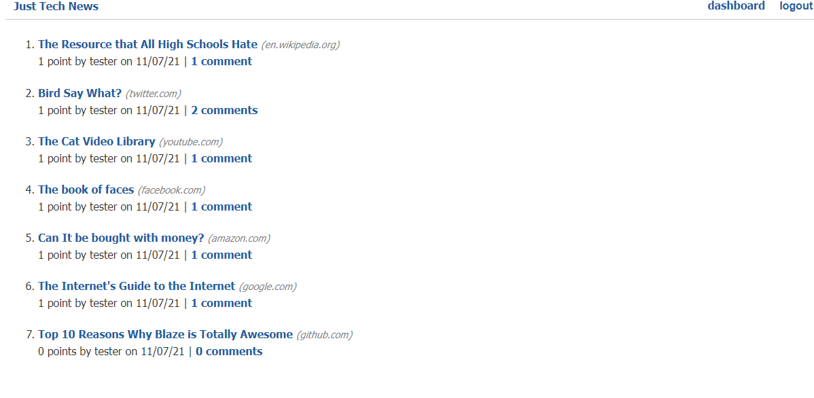

# python-newsfeed

## Description
Share wonderful tech links with the world! Just Tech News is a SQL database that uses a python backend. Create an account, make a post, discuss with others, and upvote for visibility!

## Deployed Application Link
https://blazelim.github.io/react-portfolio/

## Table of Contents
* [License](#license)
* [Questions](#questions)

## License
This project is covered under the MIT license.
[Click here to see the terms of the license](https://choosealicense.com/licenses/mit/)
## Questions
Any questions or concerns?
Contact me on my github: [blazelim](https://github.com/blazelim/)

Or email me at: blazebentleycolim@gmail.com